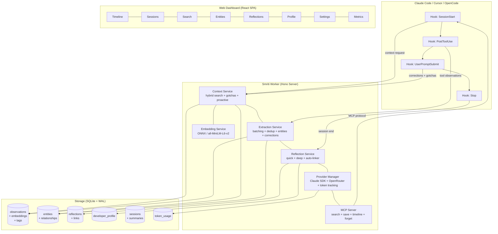

<div align="center">

<br/>

# स्मृति

## **Smriti**

### Intelligent Memory for AI Coding Assistants

<br/>

**Your AI pair programmer forgets everything between sessions. Smriti fixes that.**

<br/>

[](https://www.typescriptlang.org/)
[](https://bun.sh/)
[](https://sqlite.org/)
[](LICENSE)
[](#-test-suite)

<br/>

*Smriti* (Sanskrit: स्मृति) means **"memory"** — the faculty of remembrance.

It captures observations from your coding sessions, extracts structured knowledge,<br/>
and resurfaces the *right* context at the *right* time — not just the last N items,<br/>
but what's actually **relevant** to what you're doing right now.

<br/>

[Quick Start](#-quick-start) · [Features](#-features) · [How It Works](#-how-it-works) · [Architecture](#-architecture) · [Dashboard](#-web-dashboard) · [Configuration](#-configuration) · [MCP Tools](#-mcp-server)

<br/>

</div>

---

<br/>

## Why Smriti?

Every time you start a new session with an AI coding assistant, it begins with a blank slate. Your preferences, your project's quirks, the bugs you've already fixed, the architectural decisions you've made — all gone.

**Smriti gives your AI assistant a persistent, intelligent memory.**

It doesn't just dump a wall of text into context. It uses **embedding-based semantic search**, **recency decay**, and **importance weighting** to surface precisely the observations that matter for your current task. Over time, it builds a **developer profile** — learning your patterns, preferences, and common pitfalls.

> **Zero external dependencies.** No Python. No Chroma. No external vector databases.<br/>
> Just Bun + SQLite + local ONNX embeddings. That's it.

<br/>

---

<br/>

## Quick Start

### Prerequisites

- [Bun](https://bun.sh/) v1.0+
- [Claude Code](https://docs.anthropic.com/en/docs/claude-code) CLI

### Install

```bash
# Clone
git clone https://github.com/shubhrai2811/Smriti.git
cd Smriti

# Install dependencies
bun install

# Build the plugin (single-file esbuild bundle)
bun run build
```

### Register with Claude Code

```bash
claude plugin add ./plugin
```

That's it. Smriti will automatically:
1. Start its background worker on your next Claude Code session
2. Observe tool calls and extract structured knowledge
3. Inject relevant context into future sessions

### Verify

```bash
# Check worker health
curl http://127.0.0.1:<port>/health

# Open the web dashboard
open http://127.0.0.1:<port>/ui
```

### CLI

```bash
smriti config                                  # View all settings
smriti config get context.tokenBudget          # Read a setting
smriti config set context.tokenBudget 8000     # Change a setting
smriti config reset                            # Reset to defaults

smriti search "authentication patterns"        # Semantic search
smriti search "database" --project my-app      # Scoped search

smriti stats                                   # Memory statistics
```

<br/>

---

<br/>

## Features

### Relevance-Scored Context Injection

Smriti doesn't just return "recent" observations. Every piece of context is scored using a **hybrid ranking formula**:

```
score = (vectorWeight  * cosineSimilarity)
      + (recencyWeight * recencyDecay)
      + (importanceWeight * importanceScore)
```

| Signal | How | Default Weight |
|---|---|---|
| **Semantic similarity** | sqlite-vec KNN + all-MiniLM-L6-v2 (384-dim ONNX, computed locally) | `0.5` |
| **Recency decay** | Exponential decay with 7-day half-life | `0.3` |
| **Importance** | 1–10 scale normalized, critical observations persist longer | `0.2` |

All weights are fully configurable.

---

### Observation Batching

Most memory tools make one AI call per tool observation. Smriti **batches 5–10 observations** into a single extraction call:

```
Competitors:  10 tool calls  →  10 AI extraction calls
Smriti:       10 tool calls  →  2 AI extraction calls  (batch size 5)
```

**~60% fewer API calls** with no loss in extraction quality. Partial batches auto-flush after a configurable timeout (default 30s).

---

### Reflection & Learning

Smriti doesn't just store facts — it **thinks about them**.

| Type | Trigger | What It Does |
|---|---|---|
| **Quick Reflection** | End of each session | Identifies patterns, key decisions, and lessons within the session |
| **Deep Reflection** | Every N sessions (default: 5) | Cross-session pattern analysis, developer profile updates, recurring issue detection |

The **developer profile** learns over time:

| Category | Examples |
|---|---|
| **Preferences** | "Prefers Bun over Node.js", "Uses Commander.js for CLI" |
| **Patterns** | "Command pattern architecture", "JSON in SQLite for flexible schemas" |
| **Expertise** | "Strong SQLite concurrency management", "Data interchange formats" |
| **Style** | "TypeScript strict mode", "Strong typing discipline" |

Each entry carries a **confidence score** and **evidence count** that increases as the pattern is observed across sessions.

---

### Entity Graph

Files, functions, dependencies, and error patterns are tracked as **first-class entities** with typed relationships:

```
[auth.ts] ──imports──→ [jwt-utils.ts]
[auth.ts] ──has-error──→ "Token expiry not handled"
[auth.ts] ──modified-by──→ Session #42
```

Relationship types: `imports`, `calls`, `depends_on`, `configures`, `related_to`

**Hotspot detection** identifies frequently modified or error-prone files across sessions.

---

### Cross-IDE Memory

Smriti uses a **shared SQLite database** that works across multiple IDEs:

| IDE | Integration |
|---|---|
| **Claude Code** | Native plugin via hooks |
| **Cursor** | Installable via `scripts/install-cursor.sh` |
| **OpenCode** | Native plugin with 25+ events, custom tools, and system prompt transforms |

All observations are tagged with their source IDE and branch. Your memory follows you regardless of which tool you're using.

---

### Proactive Mid-Session Context

Smriti doesn't wait for session boundaries. When your **mid-session prompt** relates to past observations, it proactively injects relevant context — surfacing that bug fix from last week or the architectural decision from last month, right when you need it.

Configurable similarity threshold (default 0.75) and token budget (default 1500).

---

### Correction Detection

When you tell your AI assistant "no, use X instead" or "don't do that", Smriti automatically captures these as **high-importance (8+) global preference observations**. These corrections persist across projects and influence future sessions.

Detected patterns:
- "No, use X instead" / "Actually, prefer Y"
- "Don't use/do/add Z"
- "That's wrong" / "Stop using X"
- "Please change/switch/replace"

---

### Gotcha & Pitfall Warnings

When you touch a file that previously caused issues, Smriti **proactively warns you** about known pitfalls:

```
### Gotchas for files you're touching
- [bugfix] Fixed null crash in parser: Parser crashed on empty input (importance: 9)
```

Triggers on high-importance observations (bugfix, decision, pattern) matching files in the current context.

---

### Observation Deduplication

When you fix the same bug twice or revisit the same file, Smriti doesn't store redundant observations. **Cosine similarity-based deduplication** (threshold: 0.95) automatically merges near-duplicates — combining facts, concepts, and file references while keeping the highest importance score.

---

### Observation Masking

Context tokens are precious. Smriti uses **age-based detail reduction** to maximize information density:

| Age | Detail Level | What's Shown |
|---|---|---|
| Recent (0–2 sessions) | **Full** | Complete observation with all facts and context |
| Older (3–5 sessions) | **Brief** | Key facts and outcomes only |
| Oldest (6+ sessions) | **Minimal** | Title only |

Result: **~70% reduction in context tokens** while preserving essential information.

---

### Real-Time Event Stream

Connected clients receive **live updates via SSE** (Server-Sent Events) as observations are extracted. The web dashboard uses this for real-time timeline updates without polling.

```
GET /data/events    →    event: observation:new
                         data: {"id":42,"title":"Added auth middleware","type":"implementation","importance":6}
```

---

### Token Usage Tracking

Every AI call is metered and categorized:

| Operation | What It Tracks |
|---|---|
| `extraction` | Batch observation processing |
| `summary` | Session summarization |
| `quick_reflection` | End-of-session reflection |
| `deep_reflection` | Cross-session pattern analysis |

View totals by provider, operation, and time window via the `/data/metrics` API or the dashboard Metrics tab.

---

### Natural Language Time Search

Filter observations using natural language time expressions:

```bash
# API examples
/data/observations?timeExpression=today
/data/observations?timeExpression=last%203%20days
/data/observations?timeExpression=this%20week
```

Supported: `today`, `yesterday`, `this week`, `last week`, `last month`, `last N days`, `last N hours`, `N days ago`

---

### Tag System

Organize observations with custom labels:

```bash
# Add tags via API
POST /data/observations/:id/tags  →  {"tag": "auth"}

# Filter by tag
GET /data/tags                    →  [{"tag":"auth","count":5}, ...]
```

Tags can be added from the MCP tools, the web dashboard, or the API.

---

### CLAUDE.md Auto-Generation

Smriti can automatically generate and maintain a `CLAUDE.md` file in your project root with developer profile entries, key insights, and important patterns.

**Disabled by default.** Enable with:
```bash
smriti config set claudemd.enabled true
```

The generated section is delimited by HTML comments and won't overwrite your existing content.

---

### Privacy & Security

| Protection | Details |
|---|---|
| `<private>` tag stripping | Wrap sensitive content in `<private>` tags — stripped before storage |
| Secret redaction | Auto-detects AWS keys, API tokens, JWTs, passwords, connection strings, private keys, and more |
| Local-only storage | All data stays on your machine in `~/.smriti/` |
| No telemetry | Zero data sent anywhere except your configured AI provider for extraction |

---

### Export & Import

```bash
# Full project memory export
curl http://127.0.0.1:<port>/admin/export?project=my-app > backup.json

# Import on another machine
curl -X POST http://127.0.0.1:<port>/admin/import \
  -H "Content-Type: application/json" -d @backup.json
```

Exports include sessions, observations, summaries, reflections, profile entries, and entities. Version-tagged for compatibility.

---

### Provider Failover

Smriti supports **dual AI providers** with automatic failover:

| Setting | Default |
|---|---|
| Primary provider | `claude-sdk` (uses your existing Claude API key) |
| Fallback provider | OpenRouter (configurable model) |
| Failure threshold | 3 consecutive failures before switching |
| Cooldown | 5 minutes before retrying primary |

You can also run Smriti with **its own separate API key** (`provider.claudeApiKey`) to avoid billing conflicts with your main Claude usage.

<br/>

---

<br/>

## How It Works

```
                     Your Coding Session
                            │
                 ┌──────────┼───────────┐
                 │          │           │
           SessionStart   PostToolUse  UserPromptSubmit
                 │        (× N)        │
                 ▼          │          ▼
          ┌────────────┐    │   ┌──────────────┐
          │  Inject     │    │   │  Correction   │
          │  Relevant   │    │   │  Detection    │
          │  Context    │    │   │  + Gotchas    │
          └────────────┘    │   └──────────────┘
                 │          ▼
                 │   ┌──────────────┐
                 │   │  Batch       │
                 │   │  Observations│
                 │   │  (5 per call)│
                 │   └──────────────┘
                 │          │
                 │    AI Extraction
                 │    + Entity Graph
                 │    + Embeddings
                 │    + Dedup Check
                 │          │
                 ▼          ▼
          ┌─────────────────────────────────────┐
          │           SQLite Database            │
          │  ┌────────────┐  ┌───────────────┐  │
          │  │Observations│  │Entities       │  │
          │  │+ Embeddings│  │+ Relationships│  │
          │  ├────────────┤  ├───────────────┤  │
          │  │Reflections │  │Developer      │  │
          │  │+ Links     │  │Profile        │  │
          │  ├────────────┤  ├───────────────┤  │
          │  │Sessions    │  │Token Usage    │  │
          │  │+ Summaries │  │+ Tags         │  │
          │  └────────────┘  └───────────────┘  │
          └─────────────────────────────────────┘
                 │
           SessionStop
                 │
                 ▼
          ┌────────────┐
          │  Summary    │
          │  + Quick    │──── SSE broadcast
          │  Reflection │
          └────────────┘
                 │
           (every N sessions)
                 │
                 ▼
          ┌────────────┐
          │   Deep      │
          │ Reflection  │──→ Developer Profile update
          └────────────┘
```

<br/>

---

<br/>

## Architecture

### Design Principles

| Principle | Implementation |
|---|---|
| **Plugin-first** | Hooks into IDE lifecycle events (SessionStart, UserPromptSubmit, PostToolUse, Stop) |
| **Stateless worker** | All state lives in SQLite. Worker can crash and restart without data loss |
| **Claim-confirm pattern** | Atomic operations ensure data safety even during failures |
| **Hybrid search** | Vector KNN + FTS5 full-text + recency decay + importance scoring |
| **One-shot AI calls** | No persistent SDK sessions, no orphan processes |
| **Crash-safe daemon** | PID file management, zombie detection, lock files prevent duplicates |

### Tech Stack

| Layer | Technology |
|---|---|
| Runtime | **Bun** |
| Language | **TypeScript** (ESM) |
| Database | **SQLite** (bun:sqlite) with WAL mode, 8 versioned migrations |
| Vector Search | **sqlite-vec** + ONNX local embeddings (all-MiniLM-L6-v2, 384 dims) |
| HTTP Server | **Hono** |
| Build | **esbuild** (single-file bundle) |
| Web UI | **React** SPA (inline, no CSS framework) |
| AI Extraction | **Claude SDK** (primary) + **OpenRouter** (fallback) |
| Code Quality | **Biome** (linter + formatter) |

### Component Overview



<br/>

---

<br/>

## Web Dashboard

Smriti includes a built-in **React SPA** served at `/ui` — no separate build step required.

| View | What It Shows |
|---|---|
| **Timeline** | Chronological observation feed with importance indicators (color-coded), scope badges, inline tag management |
| **Sessions** | Session history with summaries, status, prompt counts, and observation counts |
| **Search** | Semantic search across all observations with relevance scoring and time filters |
| **Entities** | Entity graph with file, function, dependency, and error pattern nodes — plus hotspot ranking |
| **Reflections** | Quick and deep reflections with category badges and confidence scores |
| **Profile** | Developer profile entries organized by category with confidence and evidence counts |
| **Settings** | Live configuration editor for all settings sections |
| **Metrics** | Token usage by provider and operation, cost tracking |

Real-time updates via SSE — new observations appear in the timeline without refreshing.

<br/>

---

<br/>

## MCP Server

Smriti exposes its memory as [MCP (Model Context Protocol)](https://modelcontextprotocol.io/) tools, accessible to any MCP-compatible client.

### Tools

| Tool | Description |
|---|---|
| `smriti_search` | Semantic search with project, time, and tag filters |
| `smriti_save` | Manually save an observation with optional tags, concepts, and file paths |
| `smriti_timeline` | View recent observations for a project or session |
| `smriti_forget` | Remove specific observations (right to be forgotten) |

### Configuration

```json
{
  "mcpServers": {
    "smriti": {
      "command": "bun",
      "args": ["run", "<plugin-path>/scripts/worker-service.cjs", "mcp"]
    }
  }
}
```

<br/>

---

<br/>

## API Reference

All endpoints are served from the worker's HTTP port (default: auto-assigned, check with `curl /health`).

<details>
<summary><strong>Session Lifecycle</strong></summary>

| Method | Endpoint | Description |
|---|---|---|
| `POST` | `/sessions/init` | Create or retrieve a session, returns proactive context |
| `POST` | `/sessions/:id/observe` | Queue observation for batch processing |
| `POST` | `/sessions/:id/observe-correction` | Record user correction as high-importance observation |
| `POST` | `/sessions/:id/summarize` | Flush pending + generate summary + trigger reflections |
| `POST` | `/sessions/:id/complete` | Mark session as completed |

</details>

<details>
<summary><strong>Context</strong></summary>

| Method | Endpoint | Description |
|---|---|---|
| `GET` | `/context/inject` | Get relevance-scored context (returns markdown) |
| `POST` | `/context/gotchas` | Detect gotcha warnings for touched files |
| `POST` | `/context/claudemd` | Generate/update CLAUDE.md |

</details>

<details>
<summary><strong>Data & Search</strong></summary>

| Method | Endpoint | Description |
|---|---|---|
| `GET` | `/data/stats` | Observation count, session count, type breakdown, DB size |
| `GET` | `/data/metrics` | Token usage by provider, operation, and time window |
| `GET` | `/data/search?q=...` | Full-text + semantic search |
| `GET` | `/data/observations` | List observations (filters: project, branch, timeExpression) |
| `PUT` | `/data/observations/:id` | Update an observation |
| `DELETE` | `/data/observations/:id` | Delete an observation |
| `GET` | `/data/sessions` | List sessions by project |
| `GET` | `/data/reflections` | List reflections (filter by type: quick/deep) |
| `GET` | `/data/profile` | Developer profile entries (filter by category) |
| `GET` | `/data/entities` | List entities (files, functions, dependencies, errors) |
| `GET` | `/data/hotspots` | High-frequency entity hotspots |
| `GET` | `/data/entity-graph` | Full entity graph (nodes + edges) |
| `GET` | `/data/entities/:id/relationships` | Relationships for a specific entity |
| `GET` | `/data/links` | Observation cross-references |
| `GET` | `/data/tags` | All tags with counts |
| `POST` | `/data/observations/:id/tags` | Add tag to observation |
| `DELETE` | `/data/observations/:id/tags/:tag` | Remove tag |
| `GET` | `/data/events` | SSE stream for real-time updates |

</details>

<details>
<summary><strong>Settings & Admin</strong></summary>

| Method | Endpoint | Description |
|---|---|---|
| `GET` | `/settings` | Get all current settings |
| `PUT` | `/settings` | Update settings by section |
| `GET` | `/health` | Lightweight health check |
| `GET` | `/readiness` | Initialization status |
| `POST` | `/admin/shutdown` | Graceful daemon shutdown |
| `POST` | `/admin/maintenance` | Archive old observations + vacuum DB |
| `GET` | `/admin/export` | Export project data as JSON |
| `POST` | `/admin/import` | Import project data from JSON |

</details>

<br/>

---

<br/>

## Configuration

All settings live in `~/.smriti/settings.json` with sensible defaults. Every setting can be overridden via environment variables or the CLI.

<details>
<summary><strong>Worker</strong></summary>

| Setting | Default | Env Var | Description |
|---|---|---|---|
| `worker.port` | `0` (auto) | `SMRITI_WORKER_PORT` | HTTP server port |
| `worker.host` | `127.0.0.1` | `SMRITI_WORKER_HOST` | Bind address |
| `worker.idleTimeoutMinutes` | `30` | `SMRITI_IDLE_TIMEOUT` | Auto-shutdown after idle period |

</details>

<details>
<summary><strong>Extraction</strong></summary>

| Setting | Default | Env Var | Description |
|---|---|---|---|
| `extraction.batchSize` | `5` | `SMRITI_BATCH_SIZE` | Observations per AI extraction call |
| `extraction.maxWaitSeconds` | `30` | `SMRITI_MAX_WAIT_SECONDS` | Max wait before flushing partial batch |
| `extraction.model` | `claude-sonnet-4-5-20250929` | `SMRITI_EXTRACTION_MODEL` | Model for AI extraction |
| `extraction.maxRetries` | `3` | `SMRITI_MAX_RETRIES` | Retry count for failed extractions |

</details>

<details>
<summary><strong>Context Injection</strong></summary>

| Setting | Default | Env Var | Description |
|---|---|---|---|
| `context.tokenBudget` | `4000` | `SMRITI_TOKEN_BUDGET` | Max tokens for context injection |
| `context.showInlineSummary` | `true` | `SMRITI_INLINE_SUMMARY` | Show context summary in responses |

</details>

<details>
<summary><strong>Relevance Scoring</strong></summary>

| Setting | Default | Env Var | Description |
|---|---|---|---|
| `scoring.vectorWeight` | `0.5` | `SMRITI_VECTOR_WEIGHT` | Weight for semantic similarity |
| `scoring.recencyWeight` | `0.3` | `SMRITI_RECENCY_WEIGHT` | Weight for recency decay |
| `scoring.importanceWeight` | `0.2` | `SMRITI_IMPORTANCE_WEIGHT` | Weight for importance score |
| `scoring.dedupeThreshold` | `0.92` | `SMRITI_DEDUPE_THRESHOLD` | Cosine threshold for dedup during scoring |

</details>

<details>
<summary><strong>Reflection</strong></summary>

| Setting | Default | Env Var | Description |
|---|---|---|---|
| `reflection.enabled` | `true` | `SMRITI_REFLECTION_ENABLED` | Enable reflection system |
| `reflection.deepReflectionInterval` | `5` | `SMRITI_DEEP_REFLECTION_INTERVAL` | Sessions between deep reflections |
| `reflection.autoLinkingEnabled` | `true` | `SMRITI_AUTO_LINKING_ENABLED` | Auto-link related observations |
| `reflection.autoLinkThreshold` | `0.85` | `SMRITI_AUTO_LINK_THRESHOLD` | Similarity threshold for auto-linking |

</details>

<details>
<summary><strong>AI Provider</strong></summary>

| Setting | Default | Env Var | Description |
|---|---|---|---|
| `provider.primary` | `claude-sdk` | `SMRITI_PROVIDER_PRIMARY` | Primary AI provider (`claude-sdk` or `openrouter`) |
| `provider.openrouterModel` | `anthropic/claude-sonnet-4-5` | `SMRITI_OPENROUTER_MODEL` | OpenRouter model identifier |
| `provider.fallbackEnabled` | `true` | `SMRITI_FALLBACK_ENABLED` | Enable automatic provider fallback |
| `provider.failureThreshold` | `3` | `SMRITI_FAILURE_THRESHOLD` | Failures before switching providers |
| `provider.cooldownMinutes` | `5` | `SMRITI_COOLDOWN_MINUTES` | Cooldown before retrying failed provider |
| `provider.claudeBaseUrl` | `''` | `SMRITI_CLAUDE_BASE_URL` | Smriti's own API base URL |
| `provider.claudeApiKey` | `''` | `SMRITI_CLAUDE_API_KEY` | Smriti's own API key |

</details>

<details>
<summary><strong>Masking</strong></summary>

| Setting | Default | Env Var | Description |
|---|---|---|---|
| `masking.enabled` | `true` | `SMRITI_MASKING_ENABLED` | Enable age-based observation masking |
| `masking.briefThreshold` | `3` | `SMRITI_MASKING_BRIEF_THRESHOLD` | Sessions ago to switch to brief |
| `masking.minimalThreshold` | `6` | `SMRITI_MASKING_MINIMAL_THRESHOLD` | Sessions ago to switch to title-only |

</details>

<details>
<summary><strong>Dedup, Proactive, Gotcha, Privacy, Archival</strong></summary>

| Setting | Default | Env Var | Description |
|---|---|---|---|
| `dedup.enabled` | `true` | `SMRITI_DEDUP_ENABLED` | Observation deduplication |
| `dedup.similarityThreshold` | `0.95` | `SMRITI_DEDUP_THRESHOLD` | Cosine threshold for dedup |
| `proactive.enabled` | `true` | `SMRITI_PROACTIVE_ENABLED` | Mid-session context injection |
| `proactive.minSimilarity` | `0.75` | `SMRITI_PROACTIVE_MIN_SIMILARITY` | Min similarity for proactive context |
| `proactive.maxObservations` | `5` | `SMRITI_PROACTIVE_MAX_OBSERVATIONS` | Max observations per injection |
| `proactive.tokenBudget` | `1500` | `SMRITI_PROACTIVE_TOKEN_BUDGET` | Token budget for proactive context |
| `gotcha.enabled` | `true` | `SMRITI_GOTCHA_ENABLED` | Gotcha/pitfall warnings |
| `gotcha.minImportance` | `7` | `SMRITI_GOTCHA_MIN_IMPORTANCE` | Min importance for gotcha trigger |
| `privacy.redactSecrets` | `true` | `SMRITI_REDACT_SECRETS` | Auto-redact detected secrets |
| `privacy.stripPrivateTags` | `true` | `SMRITI_STRIP_PRIVATE` | Strip `<private>` tagged content |
| `archival.retentionDays` | `90` | `SMRITI_RETENTION_DAYS` | Days to retain observations |
| `archival.vacuumOnMaintenance` | `true` | `SMRITI_VACUUM_ON_MAINTENANCE` | Run VACUUM during maintenance |
| `claudemd.enabled` | `false` | `SMRITI_CLAUDEMD_ENABLED` | Enable CLAUDE.md auto-generation |
| `claudemd.maxEntries` | `15` | `SMRITI_CLAUDEMD_MAX_ENTRIES` | Max entries per section |

</details>

<br/>

---

<br/>

## Project Structure

```
smriti/
├── src/
│   ├── cli/
│   │   ├── commands/            # config, search, stats
│   │   ├── handlers/            # SessionStart, PostToolUse, UserPromptSubmit, Stop
│   │   ├── adapters/            # Claude Code + Cursor platform adapters
│   │   ├── hook-command.ts      # Main hook entry point
│   │   └── stdin-reader.ts      # Hook stdin JSON processing
│   ├── services/
│   │   ├── claudemd/            # CLAUDE.md auto-generator
│   │   ├── context/             # Injection, gotchas, proactive, masking, hybrid search
│   │   ├── embeddings/          # ONNX embedding service (all-MiniLM-L6-v2)
│   │   ├── extraction/          # AI extraction, batching, dedup, corrections, entities
│   │   ├── mcp/                 # MCP server + tool definitions
│   │   ├── providers/           # Claude SDK + OpenRouter + ProviderManager + token tracking
│   │   ├── reflection/          # Quick/deep reflection + auto-linker + response parser
│   │   ├── routes/              # Hono HTTP routes (sessions, context, data, settings)
│   │   ├── sqlite/              # Database layer, 8 migrations, CRUD for all tables
│   │   ├── server.ts            # Hono server setup + SSE broadcasting
│   │   └── worker-service.ts    # Background daemon entry point
│   ├── ui/
│   │   ├── views/               # Timeline, Sessions, Search, Entities, Reflections,
│   │   │                        # Profile, Settings, Metrics
│   │   ├── App.tsx              # Main app with tab routing
│   │   ├── api.ts               # API client
│   │   ├── hooks.ts             # React hooks (polling, SSE, data fetching)
│   │   ├── theme.ts             # Dark theme constants
│   │   └── types.ts             # Shared UI types
│   ├── integrations/
│   │   └── opencode/            # OpenCode native plugin
│   ├── infrastructure/          # Process manager, graceful shutdown
│   ├── shared/                  # Config, types, paths
│   └── utils/                   # Privacy, logger, git utilities, time expressions
├── plugin/
│   ├── .claude-plugin/          # Plugin manifest
│   ├── hooks/                   # Hook entry scripts
│   ├── opencode/                # OpenCode plugin bundle
│   └── mcp-config.json          # MCP server configuration
├── scripts/
│   ├── build.ts                 # esbuild bundler
│   ├── install-cursor.sh        # Cursor installation
│   └── uninstall-cursor.sh      # Cursor removal
├── tests/
│   └── e2e/                     # 330 tests across 18 files
├── docs/
│   └── CURSOR-SETUP.md
└── biome.json                   # Linter + formatter config
```

### Database Migrations

| Version | Name | What It Adds |
|---|---|---|
| 001 | Foundation | sessions, observations, summaries, prompts, pending_messages |
| 002 | Smart Context | FTS5 full-text search, embeddings table, vector index |
| 003 | Reflection | reflections, developer_profile, observation_links |
| 004 | Token Tracking | token_usage table for cost monitoring |
| 005 | Entity Graph | entities, entity_observations |
| 006 | Tags & Decay | observation_tags, retrieval tracking |
| 007 | Global Scope | Cross-project observation scope |
| 008 | Entity Relationships | entity_relationships with typed edges |

<br/>

---

<br/>

## Comparison

| Feature | **Smriti** | claude-mem | Plain CLAUDE.md |
|---|:---:|:---:|:---:|
| Persistent memory | **Yes** | Yes | Manual |
| Semantic search (embeddings) | **Yes** | No | No |
| Relevance scoring (vector + recency + importance) | **Yes** | No | No |
| Observation batching (~60% fewer API calls) | **Yes** | No (1:1) | N/A |
| Reflection & learning (quick + deep) | **Yes** | No | No |
| Developer profile | **Yes** | No | No |
| Entity graph with relationships | **Yes** | No | No |
| Observation deduplication | **Yes** | No | No |
| Proactive mid-session context | **Yes** | No | No |
| Correction detection | **Yes** | No | No |
| Gotcha/pitfall warnings | **Yes** | No | No |
| Real-time SSE events | **Yes** | No | No |
| Token usage tracking | **Yes** | No | No |
| Natural language time search | **Yes** | No | No |
| CLAUDE.md auto-generation | **Yes** | No | Manual |
| Interactive CLI | **Yes** | No | N/A |
| Cross-IDE (Claude Code + Cursor + OpenCode) | **Yes** | No | No |
| Branch-aware observations | **Yes** | No | No |
| Web dashboard | **Yes** | No | No |
| MCP server | **Yes** | No | No |
| Export/import | **Yes** | No | Manual |
| Privacy (auto secret redaction) | **Yes** | No | No |
| Observation masking (~70% token savings) | **Yes** | No | No |
| Tag system | **Yes** | No | No |
| Zero Python dependency | **Yes** | No (Chroma) | N/A |
| Crash-safe (stateless worker) | **Yes** | No (stateful) | N/A |

<br/>

---

<br/>

## Test Suite

**330 passing E2E tests** across 18 test files. No unit tests by design — all tests exercise real worker behavior with temporary SQLite databases and mock AI providers.

```bash
bun test                                    # Run all tests
bun test tests/e2e/reflection.test.ts       # Run specific file
```

| Test File | Tests | What It Covers |
|---|---|---|
| `hook-lifecycle` | Hook registration, session start/stop flow, context injection lifecycle |
| `context-injection` | Relevance scoring, token budgets, hybrid search ranking |
| `observation-batching` | Batch accumulation, flush triggers, partial batch handling |
| `worker-lifecycle` | Worker spawn/shutdown, health checks, idle timeout, crash recovery |
| `privacy` | Secret detection (12+ patterns), `<private>` stripping, redaction |
| `smart-context` | Embedding-based retrieval, vector KNN, dedup during scoring |
| `reflection` | Quick/deep reflection triggers, developer profile updates, auto-linking |
| `cost-quality` | Batch efficiency, API call reduction, provider failover mechanics |
| `multi-ide-branch` | Cross-IDE observations, branch tagging, worktree support |
| `web-ui` | Dashboard routes, all API endpoints, SPA serving, SSE |
| `enhancements` | Tags, dedup, proactive context, MCP config, export/import |
| `enhancements-p1p2p3` | Entity relationships, time expressions, global scope, corrections |
| `global-scope` | Cross-project observations, global vs project scoping |
| `phase7-polish` | Entity graph, observation masking, archival, project detection |
| `corrections` | Correction pattern detection, high-importance observation creation |
| `gotcha` | Gotcha/pitfall detection, file matching, importance thresholds |
| `cli-commands` | Config get/set/reset, search, stats endpoints |
| `provider-isolation` | Provider base URL isolation, API key management |

<br/>

---

<br/>

## Contributing

Contributions welcome! Guidelines:

1. **E2E tests only** — no unit tests. Tests exercise real behavior through the worker.
2. **Bun-native** — use `bun:sqlite`, `bun test`, and Bun APIs.
3. **No Python dependencies** — core design principle.
4. **Privacy first** — never store secrets, always redact, always strip `<private>` tags.

```bash
bun install            # Install dependencies
bun run build          # Build plugin bundle
bun test               # Run all 330 tests
bun run typecheck      # TypeScript type checking
```

<br/>

---

<br/>

## License

MIT

<br/>

---

<br/>

<div align="center">

**Smriti** — because your AI assistant should remember what matters.

<sub>Built with Bun, TypeScript, SQLite, and a belief that AI memory<br/>should be intelligent, private, and local.</sub>

<br/>
<br/>

</div>
