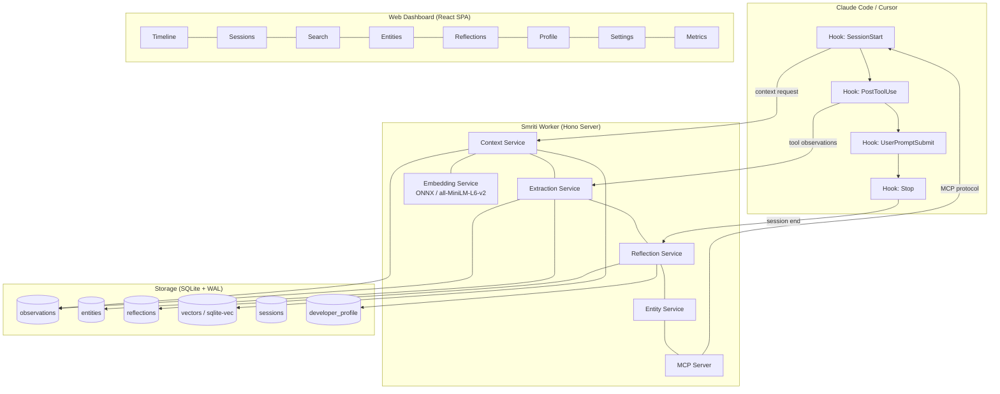

<div align="center">

# स्मृति

# **Smriti**

### *Intelligent Memory for AI Coding Assistants*

**Your AI pair programmer forgets everything between sessions. Smriti fixes that.**

[](https://www.typescriptlang.org/)
[](https://bun.sh/)
[](https://sqlite.org/)
[](LICENSE)
[](#test-suite)

<br/>

*Smriti* (Sanskrit: स्मृति) means **"memory"** -- the faculty of remembrance.

It captures observations from your coding sessions, extracts structured knowledge,<br/>
and resurfaces the *right* context at the *right* time -- not just the last N items,<br/>
but what's actually **relevant** to what you're doing right now.

<br/>

[Quick Start](#-quick-start) ·
[Features](#-features) ·
[Architecture](#-architecture) ·
[Configuration](#-configuration) ·
[Dashboard](#-web-dashboard) ·
[MCP Tools](#-mcp-server)

</div>

---

## Table of Contents

- [Why Smriti?](#-why-smriti)
- [Quick Start](#-quick-start)
- [Features](#-features)
- [How It Works](#-how-it-works)
- [Architecture](#-architecture)
- [Configuration](#-configuration)
- [MCP Server](#-mcp-server)
- [Web Dashboard](#-web-dashboard)
- [Project Structure](#-project-structure)
- [Comparison](#-comparison)
- [Test Suite](#-test-suite)
- [Contributing](#-contributing)
- [License](#-license)

---

## Why Smriti?

Every time you start a new session with an AI coding assistant, it begins with a blank slate. Your preferences, your project's quirks, the bugs you've already fixed, the architectural decisions you've made -- all gone.

**Smriti gives your AI assistant a persistent, intelligent memory.**

It doesn't just dump a wall of text into context. It uses **embedding-based semantic search**, **recency decay**, and **importance weighting** to surface precisely the observations that matter for your current task. Over time, it builds a **developer profile** -- learning your patterns, preferences, and common pitfalls.

> **Zero external dependencies.** No Python. No Chroma. No external vector databases.
> Just Bun + SQLite + local ONNX embeddings. That's it.

---

## Quick Start

### Prerequisites

- [Bun](https://bun.sh/) (v1.0+)
- [Claude Code](https://docs.anthropic.com/en/docs/claude-code) CLI

### Installation

```bash
# Clone the repository
git clone https://github.com/shubhrai2811/Smriti.git
cd Smriti

# Install dependencies
bun install

# Build the plugin (single-file esbuild bundle)
bun run build
```

### Register as Claude Code Plugin

```bash
# From the project root, register the plugin directory
claude plugin add ./plugin
```

That's it. Smriti will automatically:
1. Start its background worker on your next Claude Code session
2. Observe tool calls and extract structured knowledge
3. Inject relevant context into future sessions

### Verify It's Working

```bash
# Check worker health
curl http://127.0.0.1:<port>/health

# Open the web dashboard
open http://127.0.0.1:<port>/ui
```

### Interactive CLI

Smriti includes CLI commands for configuration and memory search:

```bash
# View all settings
smriti config

# Get/set specific settings
smriti config get context.tokenBudget
smriti config set context.tokenBudget 8000

# Search memory from terminal
smriti search "authentication patterns"
smriti search "database setup" --project my-app --limit 5

# View stats
smriti stats
```

---

## Features

### Relevance-Scored Context Injection

Smriti doesn't just return "recent" observations. Every piece of context is scored using a **hybrid ranking formula**:

```
score = (vectorWeight * cosineSimilarity)
      + (recencyWeight * recencyDecay)
      + (importanceWeight * importanceScore)
```

- **Vector similarity** via sqlite-vec + all-MiniLM-L6-v2 (384-dim ONNX embeddings, computed locally)
- **Recency decay** -- recent observations score higher, but don't dominate
- **Importance weighting** -- critical observations (errors, decisions, patterns) persist longer

Default weights: `0.5 / 0.3 / 0.2` (vector / recency / importance). Fully configurable.

---

### Observation Batching

Most memory tools make one AI call per tool observation. Smriti **batches 5-10 observations** into a single extraction call, resulting in ~60% fewer API calls with no loss in extraction quality.

```
Competitors:  10 tool calls  ->  10 AI extraction calls
Smriti:       10 tool calls  ->  2 AI extraction calls (batch size 5)
```

---

### Reflection & Learning

Smriti doesn't just store facts -- it **thinks about them**.

| Reflection Type | Trigger | What It Does |
|---|---|---|
| **Quick Reflection** | End of each session | Summarizes the session, identifies key decisions and outcomes |
| **Deep Reflection** | Every N sessions (default: 5) | Analyzes patterns across sessions, updates developer profile, detects recurring issues |

The **developer profile** tracks:
- Coding style preferences
- Common debugging patterns
- Frequently used tools and frameworks
- Recurring mistakes and their solutions

---

### Entity Graph

Files, functions, dependencies, and error patterns are tracked as **first-class entities** with relationships:

```
[auth.ts] --depends-on--> [jwt-utils.ts]
[auth.ts] --has-error----> "Token expiry not handled"
[auth.ts] --modified-by--> Session #42
```

Identify **hotspot files** (frequently modified or error-prone), trace dependency chains, and understand how your codebase evolves across sessions.

---

### Cross-IDE Memory

Smriti uses a **shared SQLite database** that works across multiple IDEs:

- **Claude Code** -- native plugin integration via hooks
- **Cursor** -- installable via `scripts/install-cursor.sh`
- **OpenCode** -- native plugin with 25+ events, custom tools, and system prompt transforms

All observations are tagged with their source IDE and branch. Your memory follows you regardless of which tool you're using.

---

### Privacy & Security

```
<private>my AWS key is AKIA...</private>   ->   [stripped, never stored]
```

| Protection | Details |
|---|---|
| `<private>` tag stripping | Wrap sensitive content in `<private>` tags; Smriti strips them before storage |
| Secret redaction | Automatically detects and redacts AWS keys, API tokens, JWTs, passwords, connection strings |
| Local-only | All data stays on your machine in `~/.smriti/` |
| No telemetry | Zero data sent anywhere except your configured AI provider for extraction |

---

### Observation Deduplication

When you fix the same bug twice or revisit the same file, Smriti doesn't store redundant observations. **Cosine similarity-based deduplication** (threshold: 0.95) automatically merges near-duplicate observations, keeping your memory clean and your context budget efficient.

---

### Proactive Context

Smriti doesn't wait for session boundaries. When your **mid-session prompt** relates to past observations, it proactively injects relevant context -- surfacing that bug fix from last week or the architectural decision from last month, right when you need it.

---

### Correction Detection

When you tell your AI assistant "no, use X instead" or "don't do that", Smriti automatically captures these as **high-importance preference observations**. These corrections persist and influence future sessions, so your AI remembers your preferences.

Correction patterns detected:
- "No, use X instead" / "Actually, prefer Y"
- "Don't use/do/add Z"
- "That's wrong" / "Stop using X"
- "Please change/switch/replace"

---

### Gotcha / Pitfall Warnings

When you touch a file that previously caused issues (high-importance bugfix, decision, or pattern observations), Smriti **proactively warns you** about known pitfalls. No more re-introducing the same bugs.

```
Touching src/parser.ts...
### Gotchas for files you're touching
- **[bugfix]** Fixed null crash in parser: Parser crashed on empty input
```

Configurable via `gotcha.enabled` and `gotcha.minImportance` settings.

---

### CLAUDE.md Auto-Generation

Smriti can automatically generate and maintain a `CLAUDE.md` file in your project root with:
- Developer profile entries
- Key insights from reflections
- Important patterns and decisions

**Disabled by default.** Enable with:
```bash
smriti config set claudemd.enabled true
```

The generated section is delimited by HTML comments and won't overwrite your existing CLAUDE.md content.

---

### Observation Masking

Context tokens are precious. Smriti uses **age-based detail reduction** to maximize information density:

| Age | Detail Level | Example |
|---|---|---|
| Recent (0-2 sessions ago) | **Full detail** | Complete observation with all context |
| Older (3-5 sessions ago) | **Brief** | Key facts and outcomes only |
| Oldest (6+ sessions ago) | **Title only** | One-line summary |

Result: **~70% reduction in context tokens** while preserving essential information.

---

### Tag System

Organize observations with custom labels:

```
smriti_save --tags "auth,security,jwt"
```

Filter and retrieve observations by tags for targeted context retrieval.

---

### Export & Import

```bash
# Full project memory export as JSON
curl http://127.0.0.1:<port>/api/export > memory-backup.json

# Import into another machine or project
curl -X POST http://127.0.0.1:<port>/api/import -d @memory-backup.json
```

Portable, backup-friendly, version-controllable.

---

## How It Works

```
                        Your Coding Session
                               |
                    +----------+-----------+
                    |                      |
              SessionStart           PostToolUse (x N)
                    |                      |
                    v                      v
            +-------------+      +-----------------+
            | Inject       |      | Batch            |
            | Relevant     |      | Observations     |
            | Context      |      | (5-10 per call)  |
            +-------------+      +-----------------+
                    |                      |
                    |               AI Extraction
                    |                      |
                    v                      v
            +-----------------------------------------+
            |            SQLite Database               |
            |  +----------+ +--------+ +------------+ |
            |  |Observations| |Entities| |Reflections| |
            |  +----------+ +--------+ +------------+ |
            |  +----------+ +--------+ +------------+ |
            |  | Vectors  | | Profile| | Sessions   | |
            |  +----------+ +--------+ +------------+ |
            +-----------------------------------------+
                    |
              SessionStop
                    |
                    v
            +-------------+
            | Quick        |
            | Reflection   |
            +-------------+
                    |
            (every N sessions)
                    |
                    v
            +-------------+
            | Deep         |
            | Reflection   |
            +-------------+
```

---

## Architecture

### Design Principles

| Principle | Implementation |
|---|---|
| **Plugin-first** | Hooks into Claude Code lifecycle events (SessionStart, UserPromptSubmit, PostToolUse, Stop) |
| **Stateless worker** | All state lives in SQLite. Worker can crash and restart without data loss |
| **Claim-confirm pattern** | Atomic operations ensure data safety even during failures |
| **Hybrid search** | Vector KNN + FTS5 full-text + recency decay + importance scoring |
| **One-shot AI calls** | No persistent SDK sessions, no orphan processes |

### Component Overview



### Tech Stack

| Layer | Technology |
|---|---|
| Runtime | **Bun** |
| Language | **TypeScript** (ESM) |
| Database | **SQLite** (bun:sqlite) with WAL mode |
| Vector Search | **sqlite-vec** + ONNX local embeddings (all-MiniLM-L6-v2, 384 dims) |
| HTTP Server | **Hono** |
| Build | **esbuild** (single-file bundle) |
| Web UI | **React** SPA (inline, no CSS framework) |
| AI Extraction | **Claude SDK** (primary) + **OpenRouter** (fallback) |

---

## Configuration

Smriti is configured via `~/.smriti/settings.json` with sensible defaults. Every setting can also be overridden with environment variables.

### Core Settings

<details>
<summary><strong>Worker</strong></summary>

| Setting | Default | Env Var | Description |
|---|---|---|---|
| `worker.port` | `0` (auto) | `SMRITI_WORKER_PORT` | HTTP server port (0 = auto-assign) |
| `worker.host` | `127.0.0.1` | `SMRITI_WORKER_HOST` | Bind address |
| `worker.idleTimeoutMinutes` | `30` | `SMRITI_IDLE_TIMEOUT` | Auto-shutdown after idle period |

</details>

<details>
<summary><strong>Extraction</strong></summary>

| Setting | Default | Env Var | Description |
|---|---|---|---|
| `extraction.batchSize` | `5` | `SMRITI_BATCH_SIZE` | Observations per AI extraction call |
| `extraction.maxWaitSeconds` | `30` | `SMRITI_MAX_WAIT_SECONDS` | Max wait before flushing partial batch |
| `extraction.model` | `claude-sonnet-4-5-20250929` | `SMRITI_EXTRACTION_MODEL` | Model for AI extraction |
| `extraction.maxRetries` | `3` | `SMRITI_MAX_RETRIES` | Retry count for failed extractions |

</details>

<details>
<summary><strong>Context Injection</strong></summary>

| Setting | Default | Env Var | Description |
|---|---|---|---|
| `context.tokenBudget` | `4000` | `SMRITI_TOKEN_BUDGET` | Max tokens for context injection |
| `context.showInlineSummary` | `true` | `SMRITI_INLINE_SUMMARY` | Show context summary in responses |

</details>

<details>
<summary><strong>Relevance Scoring</strong></summary>

| Setting | Default | Env Var | Description |
|---|---|---|---|
| `scoring.vectorWeight` | `0.5` | `SMRITI_VECTOR_WEIGHT` | Weight for semantic similarity |
| `scoring.recencyWeight` | `0.3` | `SMRITI_RECENCY_WEIGHT` | Weight for recency decay |
| `scoring.importanceWeight` | `0.2` | `SMRITI_IMPORTANCE_WEIGHT` | Weight for importance score |
| `scoring.dedupeThreshold` | `0.92` | `SMRITI_DEDUPE_THRESHOLD` | Cosine similarity threshold for dedup during scoring |

</details>

<details>
<summary><strong>Reflection</strong></summary>

| Setting | Default | Env Var | Description |
|---|---|---|---|
| `reflection.enabled` | `true` | `SMRITI_REFLECTION_ENABLED` | Enable reflection system |
| `reflection.deepReflectionInterval` | `5` | `SMRITI_DEEP_REFLECTION_INTERVAL` | Sessions between deep reflections |
| `reflection.autoLinkingEnabled` | `true` | `SMRITI_AUTO_LINKING_ENABLED` | Auto-link related observations |
| `reflection.autoLinkThreshold` | `0.85` | `SMRITI_AUTO_LINK_THRESHOLD` | Similarity threshold for auto-linking |

</details>

<details>
<summary><strong>AI Provider</strong></summary>

| Setting | Default | Env Var | Description |
|---|---|---|---|
| `provider.primary` | `claude-sdk` | `SMRITI_PROVIDER_PRIMARY` | Primary AI provider |
| `provider.openrouterModel` | `anthropic/claude-sonnet-4-5` | `SMRITI_OPENROUTER_MODEL` | OpenRouter model identifier |
| `provider.fallbackEnabled` | `true` | `SMRITI_FALLBACK_ENABLED` | Enable provider fallback |
| `provider.failureThreshold` | `3` | `SMRITI_FAILURE_THRESHOLD` | Failures before switching providers |
| `provider.cooldownMinutes` | `5` | `SMRITI_COOLDOWN_MINUTES` | Cooldown before retrying failed provider |

</details>

<details>
<summary><strong>Masking</strong></summary>

| Setting | Default | Env Var | Description |
|---|---|---|---|
| `masking.enabled` | `true` | `SMRITI_MASKING_ENABLED` | Enable age-based observation masking |
| `masking.briefThreshold` | `3` | `SMRITI_MASKING_BRIEF_THRESHOLD` | Sessions ago to switch to brief detail |
| `masking.minimalThreshold` | `6` | `SMRITI_MASKING_MINIMAL_THRESHOLD` | Sessions ago to switch to title-only |

</details>

<details>
<summary><strong>Dedup</strong></summary>

| Setting | Default | Env Var | Description |
|---|---|---|---|
| `dedup.enabled` | `true` | `SMRITI_DEDUP_ENABLED` | Enable observation deduplication |
| `dedup.similarityThreshold` | `0.95` | `SMRITI_DEDUP_THRESHOLD` | Cosine similarity threshold for dedup |

</details>

<details>
<summary><strong>Gotcha Detection</strong></summary>

| Setting | Default | Env Var | Description |
|---|---|---|---|
| `gotcha.enabled` | `true` | `SMRITI_GOTCHA_ENABLED` | Enable gotcha/pitfall warnings |
| `gotcha.minImportance` | `7` | `SMRITI_GOTCHA_MIN_IMPORTANCE` | Min importance for gotcha observations |

</details>

<details>
<summary><strong>CLAUDE.md Generation</strong></summary>

| Setting | Default | Env Var | Description |
|---|---|---|---|
| `claudemd.enabled` | `false` | `SMRITI_CLAUDEMD_ENABLED` | Enable CLAUDE.md auto-generation |
| `claudemd.maxEntries` | `15` | `SMRITI_CLAUDEMD_MAX_ENTRIES` | Max entries per section |

</details>

<details>
<summary><strong>Provider Isolation</strong></summary>

| Setting | Default | Env Var | Description |
|---|---|---|---|
| `provider.claudeBaseUrl` | `''` | `SMRITI_CLAUDE_BASE_URL` | Smriti's own API base URL (empty = direct Anthropic) |
| `provider.claudeApiKey` | `''` | `SMRITI_CLAUDE_API_KEY` | Smriti's own API key (empty = use existing) |

</details>

<details>
<summary><strong>Proactive Context</strong></summary>

| Setting | Default | Env Var | Description |
|---|---|---|---|
| `proactive.enabled` | `true` | `SMRITI_PROACTIVE_ENABLED` | Enable mid-session context injection |
| `proactive.minSimilarity` | `0.75` | `SMRITI_PROACTIVE_MIN_SIMILARITY` | Min similarity for proactive context |
| `proactive.maxObservations` | `5` | `SMRITI_PROACTIVE_MAX_OBSERVATIONS` | Max observations per injection |
| `proactive.tokenBudget` | `1500` | `SMRITI_PROACTIVE_TOKEN_BUDGET` | Token budget for proactive context |

</details>

<details>
<summary><strong>Privacy & Archival</strong></summary>

| Setting | Default | Env Var | Description |
|---|---|---|---|
| `privacy.redactSecrets` | `true` | `SMRITI_REDACT_SECRETS` | Auto-redact detected secrets |
| `privacy.stripPrivateTags` | `true` | `SMRITI_STRIP_PRIVATE` | Strip `<private>` tagged content |
| `archival.retentionDays` | `90` | `SMRITI_RETENTION_DAYS` | Days to retain observations |
| `archival.vacuumOnMaintenance` | `true` | `SMRITI_VACUUM_ON_MAINTENANCE` | Run SQLite VACUUM during maintenance |

</details>

---

## MCP Server

Smriti exposes its memory as [MCP (Model Context Protocol)](https://modelcontextprotocol.io/) tools, making it accessible to any MCP-compatible client.

### Available Tools

| Tool | Description |
|---|---|
| `smriti_search` | Search observations by semantic query, tags, or entity |
| `smriti_save` | Manually save an observation with optional tags, concepts, and file paths |
| `smriti_timeline` | View observation timeline for a project or session |
| `smriti_forget` | Remove specific observations (right to be forgotten) |

### MCP Configuration

```json
{
  "mcpServers": {
    "smriti": {
      "command": "bun",
      "args": ["run", "<plugin-path>/scripts/worker-service.cjs", "mcp"]
    }
  }
}
```

---

## Web Dashboard

Smriti includes a built-in **React SPA** served at `/ui` on the worker's HTTP port. No separate build step -- the UI is bundled inline.

### Views

| View | What It Shows |
|---|---|
| **Timeline** | Chronological feed of all observations with tags and importance indicators |
| **Sessions** | Session history with summaries, duration, and observation counts |
| **Search** | Semantic search across all observations with relevance scoring |
| **Entities** | Entity graph -- files, functions, dependencies, error patterns |
| **Reflections** | Quick and deep reflections with insights |
| **Profile** | Developer profile built from reflection analysis |
| **Settings** | Live configuration editor |
| **Metrics** | Usage stats, API call counts, token usage, batch efficiency |

---

## Project Structure

```
smriti/
├── src/
│   ├── cli/                    # Hook handlers & CLI routing
│   │   ├── commands/          # CLI commands (config, search, stats)
│   │   ├── handlers/           # SessionStart, PostToolUse, Stop handlers
│   │   ├── adapters/           # Claude Code & Cursor adapters
│   │   ├── hook-command.ts     # Main hook entry point
│   │   └── stdin-reader.ts     # Hook stdin processing
│   ├── services/
│   │   ├── claudemd/           # CLAUDE.md auto-generator
│   │   ├── context/            # Context injection, gotcha detection, relevance scoring
│   │   ├── embeddings/         # ONNX embedding service (all-MiniLM-L6-v2)
│   │   ├── extraction/         # AI-powered extraction + correction detection
│   │   ├── mcp/                # MCP server & tool definitions
│   │   ├── providers/          # Claude SDK + OpenRouter provider layer
│   │   ├── reflection/         # Quick & deep reflection engine
│   │   ├── routes/             # Hono HTTP routes (API + UI)
│   │   ├── sqlite/             # Database layer, migrations, WAL config
│   │   ├── server.ts           # Hono server setup
│   │   └── worker-service.ts   # Background worker entry point
│   ├── ui/                     # React SPA dashboard
│   │   ├── views/              # Timeline, Sessions, Search, Entities, etc.
│   │   ├── App.tsx             # Main app component with routing
│   │   ├── api.ts              # API client
│   │   ├── hooks.ts            # React hooks
│   │   └── theme.ts            # UI theme constants
│   ├── integrations/
│   │   └── opencode/          # OpenCode native plugin
│   ├── shared/                 # Shared types, config, paths, constants
│   └── utils/                  # Privacy, logging, git utilities
├── plugin/
│   ├── .claude-plugin/         # Plugin manifest (plugin.json)
│   ├── hooks/                  # Hook entry scripts
│   ├── scripts/                # Bundled worker scripts
│   └── mcp-config.json         # MCP server configuration
├── scripts/
│   ├── build.ts                # esbuild bundler config
│   ├── install-cursor.sh       # Cursor IDE installation script
│   └── uninstall-cursor.sh     # Cursor IDE removal script
├── tests/
│   └── e2e/                    # 290+ E2E tests across 16 test files
├── docs/
│   └── CURSOR-SETUP.md         # Cursor integration guide
└── package.json
```

---

## Comparison

| Feature | **Smriti** | claude-mem | Plain CLAUDE.md |
|---|:---:|:---:|:---:|
| Persistent memory | Yes | Yes | Manual |
| Semantic search (embeddings) | Yes | No (recency only) | No |
| Relevance scoring (vector + recency + importance) | Yes | No | No |
| Observation batching | Yes (~60% fewer API calls) | No (1:1) | N/A |
| Reflection & learning | Yes (quick + deep) | No | No |
| Developer profile | Yes | No | No |
| Entity graph | Yes | No | No |
| Observation deduplication | Yes (cosine similarity) | No | No |
| Proactive mid-session context | Yes | No | No |
| Correction detection | Yes | No | No |
| Gotcha/pitfall warnings | Yes | No | No |
| CLAUDE.md auto-generation | Yes (togglable) | No | Manual |
| Interactive CLI | Yes | No | N/A |
| OpenCode integration | Yes (native plugin) | No | No |
| Cross-IDE (Claude Code + Cursor) | Yes | No | No |
| Branch-aware | Yes | No | No |
| Web dashboard | Yes (React SPA) | No | No |
| MCP server | Yes | No | No |
| Export/import | Yes (JSON) | No | Manual |
| Privacy (secret redaction) | Yes (auto-detect) | No | No |
| Zero Python dependency | Yes | No (Chroma) | N/A |
| Observation masking | Yes (~70% token savings) | No | No |
| Tag system | Yes | No | No |
| Crash-safe (stateless worker) | Yes | No (stateful) | N/A |

---

## Test Suite

Smriti has **290+ passing E2E tests** across 16 test files. No unit tests by design -- all tests exercise real worker behavior with temporary SQLite databases and mock AI providers.

```bash
# Run the full test suite
bun test

# Run a specific test file
bun test tests/e2e/hook-lifecycle.test.ts
```

### Test Coverage

| Test File | What It Covers |
|---|---|
| `hook-lifecycle.test.ts` | Hook registration, SessionStart/Stop flow, context injection lifecycle |
| `context-injection.test.ts` | Relevance scoring, token budgets, hybrid search ranking |
| `observation-batching.test.ts` | Batch accumulation, flush triggers, partial batch handling |
| `worker-lifecycle.test.ts` | Worker spawn/shutdown, health checks, idle timeout, crash recovery |
| `privacy.test.ts` | Secret detection, `<private>` stripping, redaction patterns |
| `smart-context.test.ts` | Embedding-based retrieval, vector KNN, dedup during scoring |
| `reflection.test.ts` | Quick/deep reflection triggers, developer profile updates |
| `cost-quality.test.ts` | Batch efficiency, API call reduction, provider fallback |
| `multi-ide-branch.test.ts` | Cross-IDE observations, branch tagging, worktree support |
| `web-ui.test.ts` | Dashboard routes, API endpoints, SPA serving |
| `enhancements.test.ts` | Tags, dedup, proactive context, MCP config, export/import |
| `phase7-polish.test.ts` | Entity graph, observation masking, archival, project detection |
| `corrections.test.ts` | Correction pattern detection, high-importance observation creation |
| `gotcha.test.ts` | Gotcha/pitfall detection, file matching, API endpoint |
| `cli-commands.test.ts` | Config get/set/reset, search, stats endpoint |
| `provider-isolation.test.ts` | Provider base URL isolation, env var save/restore |

---

## Contributing

Contributions are welcome! Please keep these guidelines in mind:

1. **E2E tests only** -- no unit tests. Every test should exercise real behavior through the worker.
2. **Bun-native** -- use `bun:sqlite`, `bun test`, and Bun APIs where available.
3. **No Python dependencies** -- this is a core design principle.
4. **Privacy first** -- never store secrets, always redact, always strip `<private>` tags.

```bash
# Development workflow
bun install               # Install dependencies
bun run build             # Build plugin bundle
bun test                  # Run all tests
bun run typecheck         # TypeScript type checking
bun run dev               # Start worker in dev mode
```

---

## License

MIT

---

<div align="center">

**Smriti** -- because your AI assistant should remember what matters.

<sub>Built with Bun, TypeScript, SQLite, and a belief that AI memory should be intelligent, private, and local.</sub>

</div>
